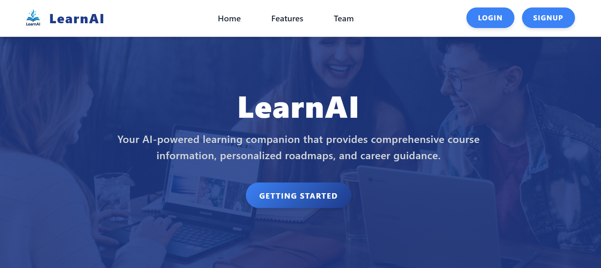
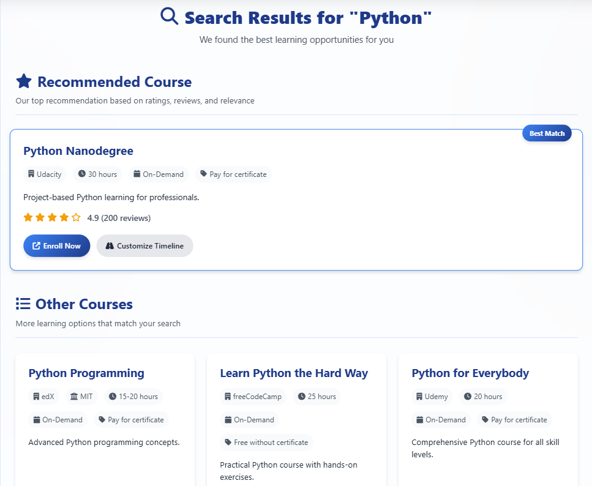
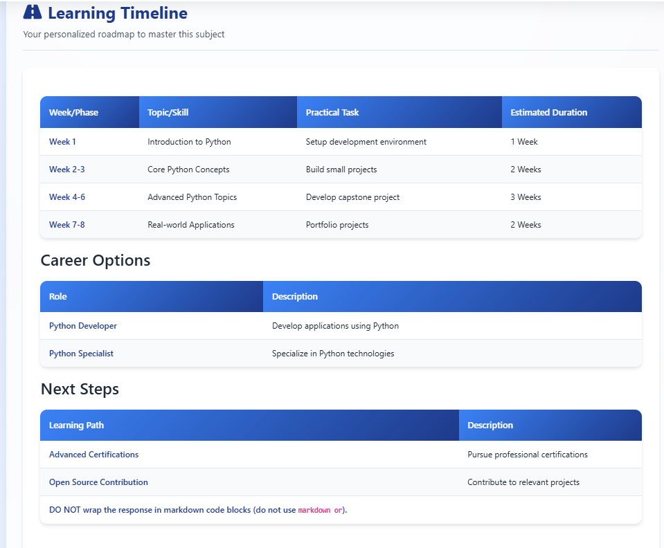

# LearnAI - Transform Your Learning Journey with AI

The online learning world is overwhelming. Thousands of platforms, endless YouTube tutorials, inconsistent reviews — and learners end up wasting time, money, and energy just figuring out *where to start*.

That’s where **LearnAI** comes in.  
An **AI-powered all-in-one learning hub** that discovers the best courses, builds personalized roadmaps, and even acts as your **24/7 AI mentor** to keep you on track.

- No more confusion.  
- No more scattered resources.  
- Just **clarity, structure, and results**.  

---

## Key Features  

### Smart Course Discovery  
- AI-powered real-time search across multiple platforms  
- Filters by pricing, difficulty, duration, and rating  

### Unbiased Reviews & Ratings  
- Consolidated ratings from multiple sources  
- AI-curated pros/cons summary so you don’t waste hours reading  

### Dynamic Learning Roadmaps  
- Personalized plans generated instantly  
- Modify and customize in one click  
- Export to **PDF timelines** for offline use  

### AI Learning Mentor (24/7)  
- Always available chatbot powered by **OpenAI + custom NLP**  
- Answers doubts, recommends next steps, keeps you motivated  

### Progress Tracking *(Upcoming)*  
- Visual dashboards for milestones  
- Weekly AI-driven insights to stay consistent  

### Community & Collaboration *(Future Roadmap)*  
- Peer-to-peer discussions  
- AI-powered study groups based on interests  

---

## Real-World Use Cases  

- **Students** -> Find best courses for coding, AI, or exams with clarity  
- **Professionals** -> Upskill with structured roadmaps while balancing work  
- **Corporates** -> Onboard teams with unified AI-powered learning journeys  

---

## Tech Stack  

- **Frontend:** React.js, HTML5, CSS3, Bootstrap  
- **Backend:** Node.js, Express.js  
- **Database:** MongoDB  
- **AI Integration:** OpenAI APIs, Custom NLP Models  
- **Deployment:** Render  

---

## Getting Started

# Clone repository
git clone https://github.com/your-username/learnai.git
cd learnai

# Install dependencies
npm install

# Run locally
npm start

---

## Demo

Live Demo - https://learnai-5.onrender.com/

Video Walkthrough - https://youtu.be/uDWALB1tsfU?feature=shared

---

## Screenshots

<table>
	<tr>
		<td></td>
		<td></td>
	</tr>
	<tr>
		<td colspan="2"></td>
	</tr>
</table>

---

## Authors  

- **M Jashwanth**  
- **Khushi Roy** 

---

Built with love to simplify learning for everyone.  

---
